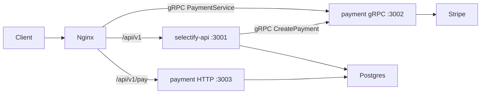

# Selectify

E-commerce backend for Selectify (`selectify.alwis.dev`), written in Go 1.24+.

Two long-running services:

| Service | Role | Ports |
|---------|------|-------|
| **selectify-api** | Catalog, auth, cart, orders | HTTP `:3001` |
| **selectify-payment** | Stripe PaymentIntents + webhooks | HTTP `:3003`, gRPC `:3002` |

Postgres is accessed through **sqlx** with separate read-write and read-only pools. Auth uses **cookie sessions**. Payments are created over **gRPC**; Stripe webhooks arrive over HTTP.

## Layout

```
backend/
  cmd/selectify-api/        # API entrypoint
  cmd/selectify-payment/    # Payment entrypoint
  cmd/selectify-event-worker/  # Stub (not used yet)
  internal/                 # Config, DB, models, repos, services, middleware
  selectify-pkg/            # API app wiring + Chi routers
  payment-pkg/              # Stripe + gRPC PaymentService
  Makefile
  db_init.sh / db_backup.sh / db_restore.sh
database/
  migrations/               # init.sql + V1_* SQL files
deploy/dev/                 # nginx TLS reverse proxy (Docker)
```

## Architecture



- The API owns catalog, sessions, cart, and orders.
- When a payment is needed, the API calls `payment.v1.PaymentService/CreatePayment` over gRPC.
- Stripe sends webhook events to the payment service at `/api/v1/pay/webhooks/stripe`.
- In local/dev, nginx in Docker terminates TLS and proxies to host processes via `host.docker.internal`.

## Prerequisites

- Go 1.24+
- PostgreSQL
- `psql` / `pg_dump` (for DB scripts)
- Docker (optional; nginx proxy only)

## Database

```bash
./backend/db_init.sh
```

Defaults: `PGHOST=localhost`, `PGPORT=5432`, `PGUSER=postgres`, `PGDATABASE=postgres`. The script runs [`database/migrations/init.sql`](database/migrations/init.sql), which creates the `selectify` database and roles.

Default roles from init:

| Role | Password (dev) |
|------|----------------|
| `selectify_rw` | `passVVord` |
| `selectify_ro` | `passVVrd` |

### Migrations

There is no automated migrator. Apply versioned SQL under [`database/migrations/`](database/migrations/) **manually in order** (`V1_1` … `V1_17`) after init.

### Tests

```bash
./backend/db_restore.sh   # restores database/backups/selectifytestdb.dump → selectifytestdb
cd backend && make test   # go test ./... -tags="test" -count=1
```

## Configuration

Each binary loads an env file named `{binaryName}.env` from the same directory as the executable (via godotenv). Env vars are prefixed with `API_` or `PAY_` and parsed with envconfig.

Templates:

- [`backend/cmd/selectify-api/env/.env-example`](backend/cmd/selectify-api/env/.env-example)
- [`backend/cmd/selectify-payment/env/.env-example`](backend/cmd/selectify-payment/env/.env-example)

### API (`API_*`)

| Variable | Purpose |
|----------|---------|
| `API_DB_HOST` / `PORT` / `DATABASE` | Postgres connection |
| `API_DB_MAX_IDLE` / `MAX_OPEN` / `MAX_LIFETIME` | Pool settings |
| `API_DB_RW_USER` / `PASSWORD` | Read-write credentials |
| `API_DB_RO_USER` / `PASSWORD` | Read-only credentials |
| `API_GRPC_PAYMENT_ADDRESS` | Payment gRPC address (default `localhost:3002`) |

### Payment (`PAY_*`)

Same DB shape as the API, plus:

| Variable | Purpose |
|----------|---------|
| `PAY_STRIPE_SECRET_KEY` | Stripe API key (required) |
| `PAY_STRIPE_WEBHOOK_SECRET` | Webhook signature verification |

## Build and run

```bash
cd backend

# API — main is behind //go:build test, so -tags test is required
go build -tags test -o selectify-api ./cmd/selectify-api
cp cmd/selectify-api/env/.env-example selectify-api.env
# edit selectify-api.env
./selectify-api

# Payment
go build -o selectify-payment ./cmd/selectify-payment
cp cmd/selectify-payment/env/.env-example selectify-payment.env
# edit selectify-payment.env (set real Stripe keys for non-test use)
./selectify-payment
```

Useful Makefile targets (from `backend/`):

| Target | Description |
|--------|-------------|
| `make test` | Run all tests with `-tags=test` |
| `make build_proto` | Regenerate payment gRPC stubs from `payment-pkg/grpc-proto/payment/payment.proto` |

## Auth

- Register / login create a `user_session` with a hashed session secret and set HttpOnly cookies `slf` (raw secret) and `slf_ss`.
- Cookies use `Secure` and `SameSite=Strict`. Regular sessions are browser cookies with a 6-hour idle timeout (absolute max 7 days) and renew hourly while active. “Keep me signed in” uses a fixed 30-day persistent cookie.
- A separate `slf_did` device cookie identifies the browser installation only; it never authenticates requests.
- Protected routes hash the `slf` cookie and load the matching non-revoked session.
- Passwords are hashed with bcrypt. New users get a customer role via `user_role`.

## HTTP API (`/api/v1`)

Chi router. Public catalog and auth; cart, orders, and user routes require a session.

| Method | Path | Auth |
|--------|------|------|
| `GET` | `/api/v1/status` | public |
| `GET` | `/api/v1/products/` | public |
| `GET` | `/api/v1/products/id/{product_id}` | public |
| `GET` | `/api/v1/products/{product_slug}` | public |
| `GET` | `/api/v1/products/{product_id}/variants` | public |
| `POST` | `/api/v1/auth/register` | public |
| `POST` | `/api/v1/auth/login` | public |
| `POST` | `/api/v1/logout` | session |
| `GET` | `/api/v1/user/info` | session |
| `GET` | `/api/v1/user/addresses/default` | session |
| `GET` | `/api/v1/cart` | session |
| `POST` | `/api/v1/cart/items` | session |
| `PATCH` | `/api/v1/cart/items/{item_id}` | session |
| `DELETE` | `/api/v1/cart/items/{item_id}` | session |
| `POST` | `/api/v1/orders` | session |
| `GET` | `/api/v1/orders` | session |
| `PUT` | `/api/v1/orders/{order_id}/address` | session |

### Payment

| Interface | Path / method |
|-----------|----------------|
| gRPC | `payment.v1.PaymentService/CreatePayment` |
| HTTP webhook | `POST /api/v1/pay/webhooks/stripe` |

## Docker (dev nginx proxy)

There is **no docker-compose** and no app/Postgres containers. Go services and Postgres run on the host. Docker is used only for an **nginx TLS reverse proxy** under [`deploy/dev/`](deploy/dev/).

Backend-related proxy locations ([`deploy/dev/conf/nginx.conf`](deploy/dev/conf/nginx.conf)):

| Location | Upstream |
|----------|----------|
| `/api/v1` | `host.docker.internal:3001` |
| `/api/v1/pay` | `host.docker.internal:3003` |
| `/payment.v1.PaymentService` | gRPC `host.docker.internal:3002` |

Server name: `selectify.alwis.dev`. HTTP on port 80 redirects to HTTPS on 443.

### Build and run

TLS certs must exist at `deploy/dev/cert/live/selectify.alwis.dev/` (`cert.pem`, `privkey.pem`, `fullchain.pem`). That directory is gitignored.

```bash
cd deploy/dev
docker build -t selectify-nginx .
docker run --rm -p 80:80 -p 443:443 selectify-nginx
```

Start `selectify-api` and `selectify-payment` on the host before (or alongside) the proxy so nginx can reach them via `host.docker.internal`.
